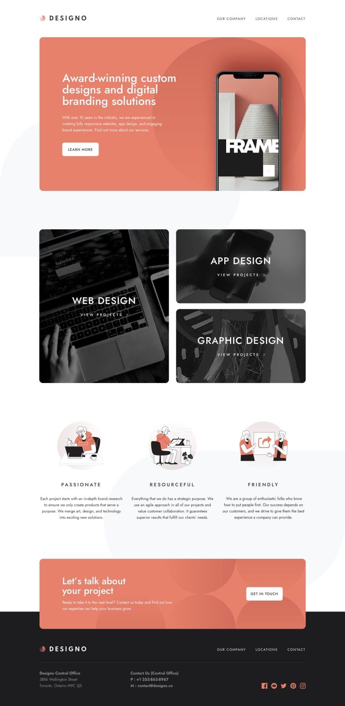

# Frontend Mentor - Designo Website

## Table of contents

-  [Overview](#overview)
   -  [The challenge](#the-challenge)
   -  [Screenshot](#screenshot)
   -  [Links](#links)
   -  [Built with](#built-with)
   -  [What I learned](#what-i-learned)
-  [Author](#author)

## Overview

### The challenge

Users should be able to:

-  View the optimal layout for the page depending on their device's screen size
-  See hover states for all interactive elements on the page

### Screenshot

[All Screenshots](./screenshots)

### Links

-  Live Site URL: (https://designo-next.vercel.app/)

### Built with

-  Next.js
-  Styled Components
-  Framer motion

### What I learned

-  Layout Manipulation using CSS
-  Second time using LeafletJS/React-Leaflet
-  Rendering leaflet maps required NO SSR. Led me to `next/dynamic`. First time I've used it

## Author

-  Website - [Ubong Sylvester](https://www.devubong.com)
